# SMO-SST experiments

This directory implements the equations and sequential SMO-SST pseudocode in `sections/system_model.tex`, `sections/problem_formulation.tex`, `sections/methods.tex`, `sections/pop_smo_sst.tex`, and `sections/results.tex`.
It includes the four internal ablations, paired experiments, normalized hypervolume (nHV), confidence intervals, independent evaluation, figures, and GIFs.
An additional opt-in `predictive_sst` group samples radial/tangential avoidance gains and weights threats by predicted closest approach and remaining projectile lifetime.
Its equations, parameter choices, sampling law, and commands are documented in [PREDICTIVE_POLICY.md](PREDICTIVE_POLICY.md).

## Install and run

Python 3.11 or newer and a C++17 compiler (`clang++` or `g++`) are required on macOS/Linux.
The native kernel is compiled automatically on first use, before the planner's timed budget.
Set `CXX` to choose a compiler and `SMO_NATIVE_CACHE` to choose a writable compilation cache if installing outside this checkout.

```sh
cd code
uv sync --locked --extra test
uv run python -m pytest -q

# Complete paper-sized study: 30 environments × four methods × 120 seconds.
# Search alone takes four hours; independent evaluation adds time.
uv run smo-sst run --config configs/paper.toml --output runs/main --save-tree

# Resume interrupted work; only completed, atomically written runs are reused.
uv run smo-sst run --config configs/paper.toml --output runs/main --save-tree --resume

# Small end-to-end check, including meaningful environment-level CI plumbing.
uv run smo-sst run --config configs/pilot.toml --output runs/pilot

# Full growing-tree throughput, not a rollout-only microbenchmark.
uv run smo-sst benchmark --config configs/paper.toml --seconds 120 \
  --output runs/benchmark.json --require-target
```

`--iterations N` replaces the wall-clock cap with a deterministic iteration budget for regression comparisons.
It does not constitute the paper's wall-clock-matched experiment.
`--threads N` sets native particle workers; the default is four.
Methods run sequentially, with randomized method order within each environment, to avoid competing for CPU resources.
Do not run simultaneous studies when collecting timing comparisons.
The benchmark exits nonzero with `--require-target` unless **every** method exceeds 1,000 complete iterations/s.
Both `run` and `benchmark` accept `--methods predictive_sst` or an explicit list containing it; the default remains the original four baselines.
Performance depends on the machine and the specified particle count, horizon, and witness settings.

## Reactive SMO-SST witness-radius sweep

The configurations in `configs/reactive_sst_witness_sweep/` use eight witness radii (`delta_w` / `witness_radius`): **0.00625, 0.0125, 0.025, 0.05, 0.1, 0.25, 0.5, 1.0**.
They span factors of 1/4, 1/2, 1, 2, 4, 10, 20, and 40 around the current 0.025 setting.
Each radius runs `reactive_sst` on the same five environments and seeds with **150,000 iterations per environment**, for 40 runs and 6,000,000 planner iterations overall.
All other scientific settings match `paper.toml`, including 256 construction particles, 4096 fresh-evaluation particles, depth 20, and seed 2000.
The iteration budget replaces the wall-clock cap.
The completed sweep used 16 native rollout workers at every radius; therefore, the
quality and tree-size comparisons are iteration matched, while the throughput values
describe this specific 16-worker execution.

### Completed sweep results

The completed five-environment sweep produced the following means and 95% bias-corrected
and accelerated (BCa) bootstrap confidence intervals. The retained-node count includes
active nodes and surviving inactive ancestors needed for policy genealogy. Construction
nHV evaluates the particle front formed during search, whereas fresh-evaluation nHV
replays the frozen selected policies with 4096 new particles.

| $\delta_w$ | Construction nHV (95% CI) | Fresh-evaluation nHV (95% CI) | Retained nodes (95% CI) | Iterations/s (95% CI) |
| ---: | ---: | ---: | ---: | ---: |
| 0.00625 | 0.706 [0.701, 0.711] | 0.705 [0.699, 0.710] | 146,685 [144,614, 148,027] | 2,369 [2,273, 2,464] |
| 0.0125 | 0.709 [0.704, 0.716] | 0.706 [0.701, 0.712] | 143,747 [141,790, 146,670] | 2,141 [2,072, 2,214] |
| 0.025 | 0.707 [0.697, 0.717] | 0.706 [0.694, 0.716] | 126,434 [118,441, 137,492] | 2,019 [1,961, 2,142] |
| 0.05 | 0.733 [0.723, 0.744] | 0.730 [0.719, 0.740] | 37,651 [24,367, 51,970] | 2,118 [2,003, 2,181] |
| 0.1 | 0.764 [0.760, 0.766] | 0.762 [0.758, 0.764] | 2,921 [2,610, 3,186] | 1,611 [1,485, 1,801] |
| 0.25 | 0.769 [0.766, 0.771] | 0.766 [0.762, 0.771] | 882 [845, 932] | 1,564 [1,281, 2,004] |
| 0.5 | 0.769 [0.765, 0.772] | 0.768 [0.764, 0.771] | 514 [457, 588] | 2,649 [2,585, 2,711] |
| 1.0 | 0.765 [0.755, 0.773] | 0.761 [0.750, 0.770] | 320 [197, 426] | 2,744 [2,610, 2,906] |

Mean construction and fresh-evaluation nHV remained near 0.71 through
`delta_w=0.025`, increased to approximately 0.73 at `delta_w=0.05`, and reached
approximately 0.76 to 0.77 for radii from 0.1 through 1.0. The largest mean
fresh-evaluation nHV was 0.768 at `delta_w=0.5`; however, its pointwise interval
overlaps those at 0.25 and 1.0, and these intervals are not confidence intervals
for paired differences. The five-environment sweep therefore does not identify a
statistically preferred radius. The decrease in mean fresh-evaluation nHV from 0.768
at `delta_w=0.5` to 0.761 at 1.0 instead indicates diminishing returns and possible
over-pruning at the largest tested radius, which requires a larger paired study to
resolve.

Fresh-evaluation nHV was within 0.004 of construction nHV at every radius. Thus, this
sweep did not reveal a large construction-to-replay gap for the selected finite
portfolios, although it does not establish population-level estimator consistency.
At the same time, the mean retained graph contracted from 146,685 nodes at
`delta_w=0.00625` to 320 at 1.0, a 458-fold reduction. The finite-budget results
therefore show that coarser witness aggregation can improve the selected portfolio
while greatly reducing retained state, but they do not imply that larger radii preserve
the manuscript's exact-law guarantees or remain beneficial outside these environments.

Throughput changed nonmonotonically with the radius. It decreased from 2,369
iterations/s at `delta_w=0.00625` to 1,564 iterations/s at 0.25, then increased to
2,649 and 2,744 iterations/s at 0.5 and 1.0. Retained-node count alone therefore does
not determine runtime, because the witness radius also changes candidate matching,
representative replacement, and pruning work.

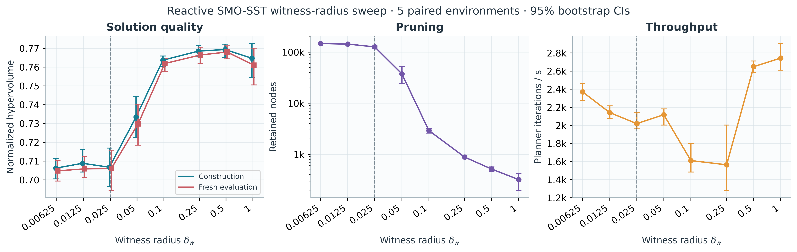

[PDF](figures/delta_w_sweep.pdf) · [SVG](figures/delta_w_sweep.svg) ·
[plotted values](figures/delta_w_sweep.csv)

### Active-tree structure

The environment-0 tree visualization shows how the active spatial structure changes
under the same launchers and random seeds. Each active node is placed at the particle
mean ego position, and an edge is drawn only when both the child and its retained parent
are active.

| $\delta_w$ | Active nodes | Active-to-active edges |
| ---: | ---: | ---: |
| 0.00625 | 141,531 | 138,953 |
| 0.0125 | 138,082 | 135,009 |
| 0.025 | 106,366 | 97,168 |
| 0.05 | 11,501 | 7,597 |
| 0.1 | 1,743 | 916 |
| 0.25 | 488 | 262 |
| 0.5 | 342 | 200 |
| 1.0 | 210 | 124 |

For radii at or below 0.025, the active-node means form a broad cloud over the
sampling region. At 0.05, the tree contracts toward the upper-right portion of the
environment, and radii of 0.1 or larger expose a progressively narrower corridor from
the start toward the reference target. This contraction is consistent with stronger
witness merging and explains the storage reduction, but the visualization alone does
not establish better exploration. Inactive genealogical ancestors are intentionally
omitted, so an active point without a displayed incoming edge can still have a valid
saved policy history.

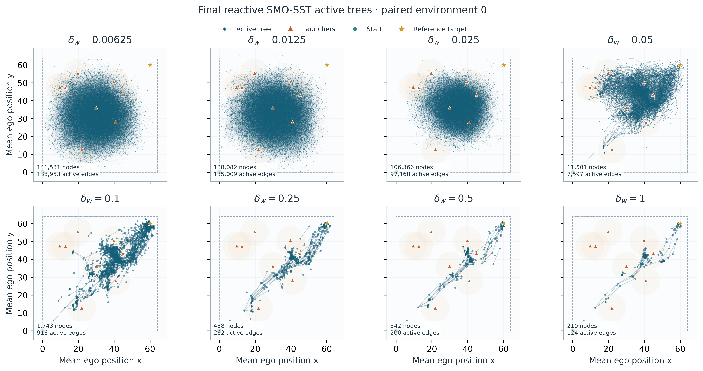

[PDF](figures/delta_w_trees_env_000.pdf) ·
[SVG](figures/delta_w_trees_env_000.svg)

```sh
# From code/: run all eight radii sequentially, with separate reports and manifests.
bash configs/reactive_sst_witness_sweep/run.sh

# Resume completed environment/radius pairs in the same output directory.
bash configs/reactive_sst_witness_sweep/run.sh runs/reactive_sst_witness_sweep --resume

# Run just one radius; every TOML is compatible with the existing CLI.
uv run --locked smo-sst run --config configs/reactive_sst_witness_sweep/delta_w_0.025.toml \
  --methods reactive_sst --output runs/reactive_sst_delta_w_0.025 --save-tree
```

The launcher saves retained trees and writes each radius under `runs/reactive_sst_witness_sweep/delta_w_<radius>/` by default.
Its optional first argument selects the output root; relative paths are resolved from `code/`.
Subsequent arguments are forwarded to `smo-sst run`, for example `--resume`.
Reports are generated separately for each radius.

Visualize a completed sweep without rerunning the planner:

```sh
uv run --locked python configs/reactive_sst_witness_sweep/visualize.py \
  --output figures

# Optionally select a different sweep root or figure directory.
uv run --locked python configs/reactive_sst_witness_sweep/visualize.py \
  runs/reactive_sst_witness_sweep --output runs/reactive_sst_witness_sweep/figures
```

The script checks that the scientific configurations differ only in `witness_radius`,
verifies paired environment seeds and launcher placements, and rejects stale report
means. Worker counts are preserved in the CSV and plotted as separate throughput groups
if they differ. It writes the quality/pruning/throughput figure as PDF, editable SVG,
and PNG, together with the plotted values in `delta_w_sweep.csv`.

Plot the final active-node trees for a selected zero-based environment ID:

```sh
uv run --locked python configs/reactive_sst_witness_sweep/visualize_trees.py 0 \
  --output figures

# Select a different grid width or output directory.
uv run --locked python configs/reactive_sst_witness_sweep/visualize_trees.py 3 \
  --columns 2 --output runs/reactive_sst_witness_sweep/tree_figures
```

Each panel shows active nodes at their saved particle-mean ego position and draws an
edge only when both the child and its saved parent are active. The paired launcher
layout, launcher ranges, start, target, and sampling-region boundary are repeated in
every panel. Dense tree layers are rasterized inside the otherwise vector PDF/SVG so
the paper-ready files remain compact. Incomplete radii are reported and skipped, so
the command is also safe to use while later sweep values are still running.

## Held-out figure gallery

The `figures/` directory contains presentation artifacts derived from saved runs; raw
run JSON, tree arrays, and reports remain under `runs/`. The planner-comparison figures
below use the manuscript-aligned `paper_final_improved_witness` study: 30 paired
environments, a 120-second budget per method and environment, witness radius 0.25 for
SMO-SST, and independent replay of each selected portfolio with 4096 particles.

### Aggregate planner comparison

The normalized-hypervolume figure reports means and 95% environment-bootstrap
confidence intervals for the construction fronts and fresh evaluation of the frozen
selected portfolios.

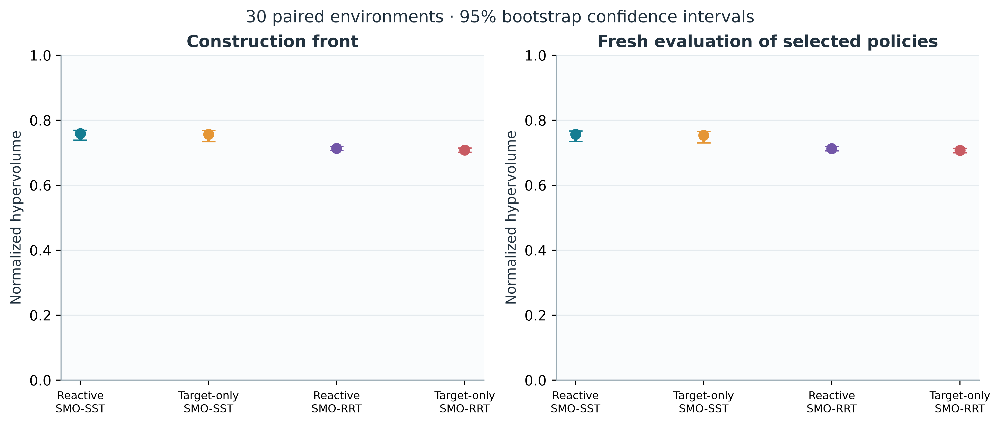

[PDF](figures/paper/nhv.pdf) · [SVG](figures/paper/nhv.svg)

The progress curves show mean construction nHV over planner wall time. Bands are
environment interquartile ranges, not confidence intervals.

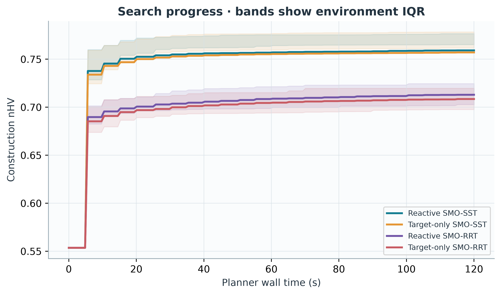

[PDF](figures/paper/progress.pdf) · [SVG](figures/paper/progress.svg)

### Representative Pareto fronts

The following plot compares the fresh-evaluation Pareto fronts returned by all four
baseline planners in paired environment 0. It is one environment-level example rather
than an aggregate performance comparison; the 30-environment nHV intervals above carry
the population-level comparison used in the manuscript.

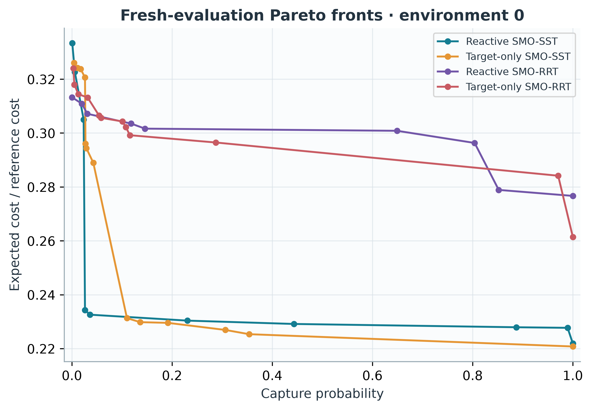

[PDF](figures/paper/fronts-000.pdf) · [SVG](figures/paper/fronts-000.svg)

### Representative fresh-rollout animations

Each animation replays the saved environment-0 policy with the largest single-policy
fresh-evaluation hypervolume rectangle. All four use 32 new particles and seed 98765;
they visualize representative stochastic trajectories rather than construction samples
or additional statistical trials. Red particle markers indicate capture, and the red
crosses show active adversaries for particle 1 only.

| Reactive SMO-SST | Target-only SMO-SST |
|:---:|:---:|
| 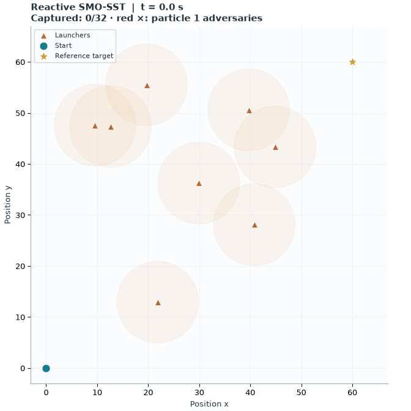 | 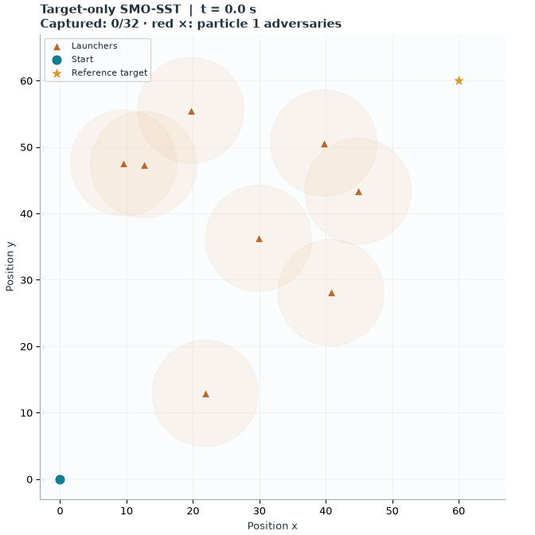 |
| [PNG](figures/paper/trajectory-000-reactive_sst-point5.png) · [PDF](figures/paper/trajectory-000-reactive_sst-point5.pdf) · [SVG](figures/paper/trajectory-000-reactive_sst-point5.svg) · [metadata](figures/paper/trajectory-000-reactive_sst-point5.json) | [PNG](figures/paper/trajectory-000-target_sst-point5.png) · [PDF](figures/paper/trajectory-000-target_sst-point5.pdf) · [SVG](figures/paper/trajectory-000-target_sst-point5.svg) · [metadata](figures/paper/trajectory-000-target_sst-point5.json) |

| Reactive SMO-RRT | Target-only SMO-RRT |
|:---:|:---:|
|  | 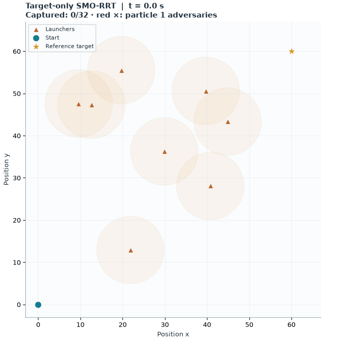 |
| [PNG](figures/paper/trajectory-000-reactive_rrt-point0.png) · [PDF](figures/paper/trajectory-000-reactive_rrt-point0.pdf) · [SVG](figures/paper/trajectory-000-reactive_rrt-point0.svg) · [metadata](figures/paper/trajectory-000-reactive_rrt-point0.json) | [PNG](figures/paper/trajectory-000-target_rrt-point1.png) · [PDF](figures/paper/trajectory-000-target_rrt-point1.pdf) · [SVG](figures/paper/trajectory-000-target_rrt-point1.svg) · [metadata](figures/paper/trajectory-000-target_rrt-point1.json) |

### Complete environment-0 Pareto portfolios

Every policy returned in the environment-0 construction Pareto portfolio is shown
below, grouped by planner (55 policies total). Each label reports the independent
4,096-particle fresh evaluation: risk is the observed capture count and rate, while
cost is the fresh expected cost followed by its normalization using
$\bar{C}=420$. Because the portfolios were selected from construction samples, the
fresh estimates can reorder the policies or make one returned member dominate another;
the tables intentionally retain every returned policy rather than filtering them again.

The compact animations use 16 particles, the corresponding saved evaluation-stream
seed, and at most 48 frames. They are qualitative views of policy behavior; the numeric
labels come from the 4,096-particle evaluation, not from counting the animated particles.

#### Reactive SMO-SST (12 points)

| **Point 1**<br>risk = 3/4096 = 0.00073<br>cost = 140.013; cost / $\bar{C}$ = 0.3334 | **Point 2**<br>risk = 24/4096 = 0.00586<br>cost = 135.540; cost / $\bar{C}$ = 0.3227 | **Point 3**<br>risk = 96/4096 = 0.02344<br>cost = 128.110; cost / $\bar{C}$ = 0.3050 |
|:---:|:---:|:---:|
| 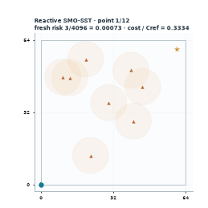 | 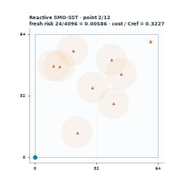 | 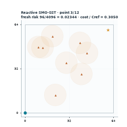 |

| **Point 4**<br>risk = 121/4096 = 0.02954<br>cost = 125.286; cost / $\bar{C}$ = 0.2983 | **Point 5**<br>risk = 115/4096 = 0.02808<br>cost = 125.018; cost / $\bar{C}$ = 0.2977 | **Point 6**<br>risk = 107/4096 = 0.02612<br>cost = 98.419; cost / $\bar{C}$ = 0.2343 |
|:---:|:---:|:---:|
| 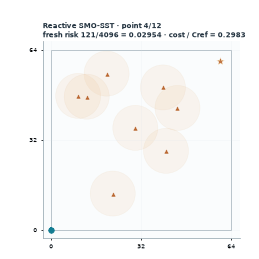 | 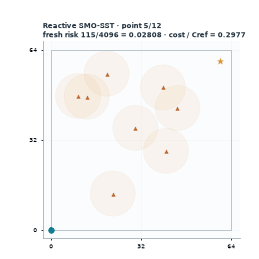 |  |

| **Point 7**<br>risk = 147/4096 = 0.03589<br>cost = 97.708; cost / $\bar{C}$ = 0.2326 | **Point 8**<br>risk = 944/4096 = 0.23047<br>cost = 96.781; cost / $\bar{C}$ = 0.2304 | **Point 9**<br>risk = 1815/4096 = 0.44312<br>cost = 96.261; cost / $\bar{C}$ = 0.2292 |
|:---:|:---:|:---:|
| 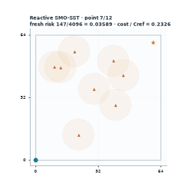 |  |  |

| **Point 10**<br>risk = 3635/4096 = 0.88745<br>cost = 95.747; cost / $\bar{C}$ = 0.2280 | **Point 11**<br>risk = 4053/4096 = 0.98950<br>cost = 95.658; cost / $\bar{C}$ = 0.2278 | **Point 12**<br>risk = 4096/4096 = 1.00000<br>cost = 93.218; cost / $\bar{C}$ = 0.2219 |
|:---:|:---:|:---:|
| 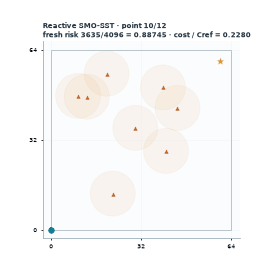 | 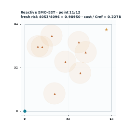 |  |

#### Target-only SMO-SST (18 points)

| **Point 1**<br>risk = 18/4096 = 0.00439<br>cost = 136.966; cost / $\bar{C}$ = 0.3261 | **Point 2**<br>risk = 45/4096 = 0.01099<br>cost = 136.159; cost / $\bar{C}$ = 0.3242 | **Point 3**<br>risk = 71/4096 = 0.01733<br>cost = 136.011; cost / $\bar{C}$ = 0.3238 |
|:---:|:---:|:---:|
|  | 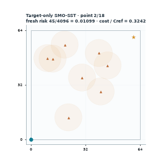 | 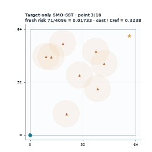 |

| **Point 4**<br>risk = 107/4096 = 0.02612<br>cost = 134.678; cost / $\bar{C}$ = 0.3207 | **Point 5**<br>risk = 111/4096 = 0.02710<br>cost = 124.368; cost / $\bar{C}$ = 0.2961 | **Point 6**<br>risk = 118/4096 = 0.02881<br>cost = 123.660; cost / $\bar{C}$ = 0.2944 |
|:---:|:---:|:---:|
|  | 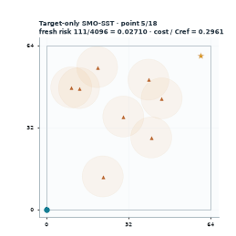 | 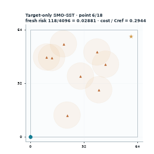 |

| **Point 7**<br>risk = 204/4096 = 0.04980<br>cost = 123.236; cost / $\bar{C}$ = 0.2934 | **Point 8**<br>risk = 224/4096 = 0.05469<br>cost = 123.025; cost / $\bar{C}$ = 0.2929 | **Point 9**<br>risk = 291/4096 = 0.07104<br>cost = 122.919; cost / $\bar{C}$ = 0.2927 |
|:---:|:---:|:---:|
|  | 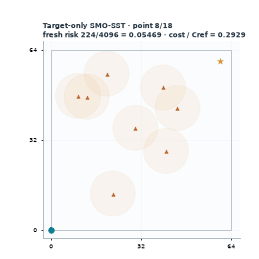 |  |

| **Point 10**<br>risk = 285/4096 = 0.06958<br>cost = 122.925; cost / $\bar{C}$ = 0.2927 | **Point 11**<br>risk = 175/4096 = 0.04272<br>cost = 121.383; cost / $\bar{C}$ = 0.2890 | **Point 12**<br>risk = 450/4096 = 0.10986<br>cost = 97.172; cost / $\bar{C}$ = 0.2314 |
|:---:|:---:|:---:|
|  |  |  |

| **Point 13**<br>risk = 558/4096 = 0.13623<br>cost = 96.542; cost / $\bar{C}$ = 0.2299 | **Point 14**<br>risk = 785/4096 = 0.19165<br>cost = 96.431; cost / $\bar{C}$ = 0.2296 | **Point 15**<br>risk = 1308/4096 = 0.31934<br>cost = 95.755; cost / $\bar{C}$ = 0.2280 |
|:---:|:---:|:---:|
|  |  | 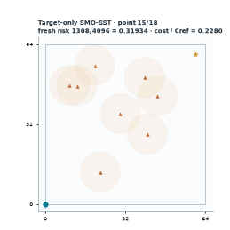 |

| **Point 16**<br>risk = 1254/4096 = 0.30615<br>cost = 95.330; cost / $\bar{C}$ = 0.2270 | **Point 17**<br>risk = 1449/4096 = 0.35376<br>cost = 94.667; cost / $\bar{C}$ = 0.2254 | **Point 18**<br>risk = 4096/4096 = 1.00000<br>cost = 92.750; cost / $\bar{C}$ = 0.2208 |
|:---:|:---:|:---:|
| 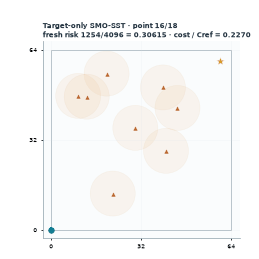 |  | 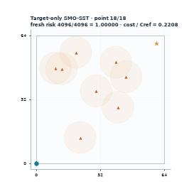 |

#### Reactive SMO-RRT (11 points)

| **Point 1**<br>risk = 1/4096 = 0.00024<br>cost = 131.586; cost / $\bar{C}$ = 0.3133 | **Point 2**<br>risk = 81/4096 = 0.01978<br>cost = 130.593; cost / $\bar{C}$ = 0.3109 | **Point 3**<br>risk = 126/4096 = 0.03076<br>cost = 129.019; cost / $\bar{C}$ = 0.3072 |
|:---:|:---:|:---:|
| 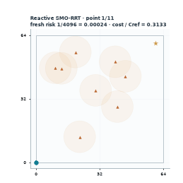 |  | 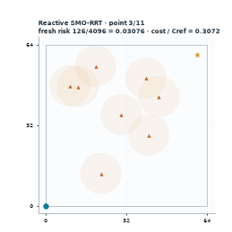 |

| **Point 4**<br>risk = 503/4096 = 0.12280<br>cost = 128.227; cost / $\bar{C}$ = 0.3053 | **Point 5**<br>risk = 484/4096 = 0.11816<br>cost = 127.488; cost / $\bar{C}$ = 0.3035 | **Point 6**<br>risk = 703/4096 = 0.17163<br>cost = 127.678; cost / $\bar{C}$ = 0.3040 |
|:---:|:---:|:---:|
|  |  |  |

| **Point 7**<br>risk = 598/4096 = 0.14600<br>cost = 126.702; cost / $\bar{C}$ = 0.3017 | **Point 8**<br>risk = 2659/4096 = 0.64917<br>cost = 126.367; cost / $\bar{C}$ = 0.3009 | **Point 9**<br>risk = 3293/4096 = 0.80396<br>cost = 124.470; cost / $\bar{C}$ = 0.2964 |
|:---:|:---:|:---:|
| 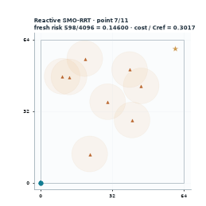 | 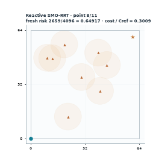 | 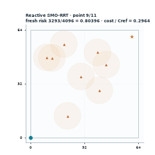 |

| **Point 10**<br>risk = 3490/4096 = 0.85205<br>cost = 117.152; cost / $\bar{C}$ = 0.2789 | **Point 11**<br>risk = 4096/4096 = 1.00000<br>cost = 116.221; cost / $\bar{C}$ = 0.2767 |  |
|:---:|:---:|:---:|
|  | 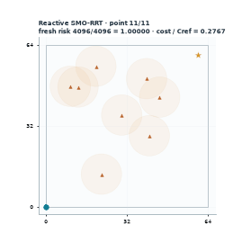 |  |

#### Target-only SMO-RRT (14 points)

| **Point 1**<br>risk = 12/4096 = 0.00293<br>cost = 136.102; cost / $\bar{C}$ = 0.3241 | **Point 2**<br>risk = 20/4096 = 0.00488<br>cost = 133.555; cost / $\bar{C}$ = 0.3180 | **Point 3**<br>risk = 53/4096 = 0.01294<br>cost = 132.081; cost / $\bar{C}$ = 0.3145 |
|:---:|:---:|:---:|
| 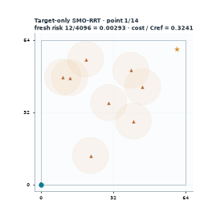 |  |  |

| **Point 4**<br>risk = 129/4096 = 0.03149<br>cost = 131.541; cost / $\bar{C}$ = 0.3132 | **Point 5**<br>risk = 224/4096 = 0.05469<br>cost = 130.002; cost / $\bar{C}$ = 0.3095 | **Point 6**<br>risk = 222/4096 = 0.05420<br>cost = 128.741; cost / $\bar{C}$ = 0.3065 |
|:---:|:---:|:---:|
| 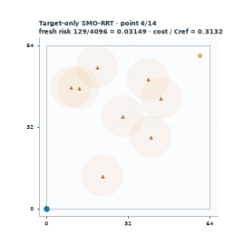 |  |  |

| **Point 7**<br>risk = 239/4096 = 0.05835<br>cost = 128.388; cost / $\bar{C}$ = 0.3057 | **Point 8**<br>risk = 413/4096 = 0.10083<br>cost = 127.822; cost / $\bar{C}$ = 0.3043 | **Point 9**<br>risk = 441/4096 = 0.10767<br>cost = 126.953; cost / $\bar{C}$ = 0.3023 |
|:---:|:---:|:---:|
|  | 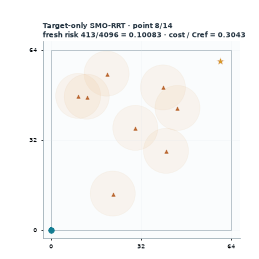 | 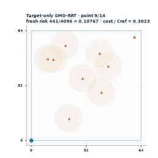 |

| **Point 10**<br>risk = 474/4096 = 0.11572<br>cost = 125.679; cost / $\bar{C}$ = 0.2992 | **Point 11**<br>risk = 1177/4096 = 0.28735<br>cost = 124.542; cost / $\bar{C}$ = 0.2965 | **Point 12**<br>risk = 3778/4096 = 0.92236<br>cost = 124.893; cost / $\bar{C}$ = 0.2974 |
|:---:|:---:|:---:|
| 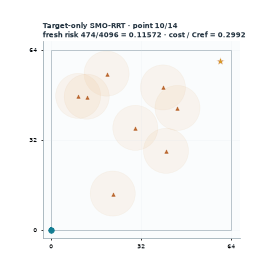 | 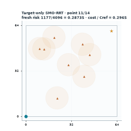 | 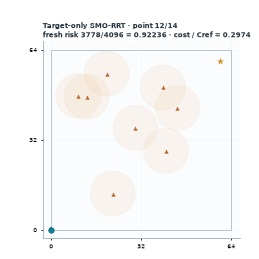 |

| **Point 13**<br>risk = 3976/4096 = 0.97070<br>cost = 119.365; cost / $\bar{C}$ = 0.2842 | **Point 14**<br>risk = 4096/4096 = 1.00000<br>cost = 109.818; cost / $\bar{C}$ = 0.2615 |  |
|:---:|:---:|:---:|
|  |  |  |

[Point metadata (CSV)](figures/pareto_env_000/points.csv) ·
[rendering manifest (JSON)](figures/pareto_env_000/manifest.json)

The exact generation commands and source-study provenance are recorded in
[`figures/README.md`](figures/README.md).

## Figures and GIF interface

```sh
# nHV means and CIs, wall-clock progress, and a selected environment's Pareto fronts.
# Every static figure is written as vector PDF, editable SVG, and 400-dpi PNG.
uv run smo-sst figures runs/main --environment 0 --dpi 400

# Fresh replay of a selected policy: trajectory PDF/SVG/PNG plus animated GIF.
uv run smo-sst animate runs/main --method reactive_sst --environment 0 \
  --particles 48 --dpi 160 --fps 24 --speed 8 --max-frames 240

# Select a particular saved front member and reproduce the same animation.
uv run smo-sst animate runs/main --method target_sst --environment 2 \
  --point 1 --seed 98765 --particles 32 --no-gif --dpi 600

# Rebuild statistical tables without rerunning planning.
uv run smo-sst report runs/main
```

`--point` indexes the saved construction front, including the empty policy when nondominated.
By default, visualization chooses the policy with the largest single-policy hypervolume rectangle using fresh evaluation estimates.
Animation uses new rollouts with its own recorded seed, not construction particles.
Animated particle markers turn red after capture, but simulation continues.
The static figure colors an entire trajectory red if that rollout eventually fails.
The animation shows active adversaries from particle 1 only, because each particle has a different hybrid environment state.
The figure and animation explicitly identify this choice.
Frame capping can increase playback speed beyond the requested nominal speed; frame times are saved in the adjacent JSON metadata.
Use `--max-frames` and `--dpi` to control GIF memory and file size.
Static scientific plots use Matplotlib, with embedded fonts in PDF and text retained in SVG.

## Algorithm fidelity

Each iteration uniformly selects **one** active node with policy depth below `max_depth`, then samples a waypoint uniformly in `[0,64]^2` and an integer duration uniformly in `1..tau_max`.
The root remains selectable throughout the search.
There is no goal bias, nearest-state parent rule, bounded-lag proposal batch, failed-particle resampling, or goal-acceptance gate.
These mechanisms appear in predecessor material but are absent from the current active pseudocode and objective.

Every node stores an empirical joint terminal-state law: ego `(px,py,theta,v)`, each labeled adversary `(rx,ry,n,mode)`, and the absorbing failure indicator.
Particles additionally carry cumulative running cost, which is excluded from the state-space transport metric.
Failure is endpoint capture by an active adversary, with the indicator absorbing after the first violation.
All failed particles continue evolving and contributing to both expectations with the original fixed denominator.
The score is the mean running cost plus the current terminal cost, so extending a policy replaces the previous terminal contribution rather than accumulating it again.
Policies of every retained depth, including zero, belong to the solution space.
The final construction Pareto front is extracted from retained active nodes **and their surviving inactive ancestors**, matching the graph returned by the algorithm.

Witnesses are permanently centered at their first cloud and partitioned by **policy depth**, not elapsed simulation steps.
The representative update first computes strict Pareto nondominance, then retains the minimum-cost member of each `floor(risk/risk_resolution)` cell, breaking ties by risk and creation order.
It also handles the endpoint cell at risk one.
Pruned representatives become inactive; leaf deletion recursively removes unused inactive ancestors.
Inactive ancestors retain genealogy for policy reconstruction but release rollout storage unless the cloud is also a witness center.
RRT disables witness assignment and pruning and otherwise uses the identical simulator, sampling, and objective.

The original four groups use the unicycle feedback formulas preserved in the comments of `sections/results.tex`.
Predictive SMO-SST uses the separately documented additional family with the same speed law and physical dynamics.
Process noise is exactly `2*Beta(3,3)-1`, scaled by the specified coordinate half-widths.
The rejection sampler has acceptance probability `8/15` and does not approximate Beta noise by a Gaussian or a lookup table.
At exactly zero pursuit distance, the adversary's deterministic displacement is defined as zero.
Controls, stochastic mode transitions, and pursuit directions use the current state.
Newly activated adversaries begin moving on the next step; newly terminal adversaries cannot capture at that endpoint.
The 64-by-64 region bounds waypoint sampling; trajectories are not clipped to its boundary.
Heading is unwrapped, consistent with the paper's Euclidean ego-state metric.

## Transport acceleration and its limits

The full ground metric is the manuscript's

```text
d_b = (||x-x'||_2 + ||z-z'||_2 + C_M 1[m != m']) / D_Y + |b-b'|.
```

`m != m'` means disagreement in the joint labeled mode tuple, counted once, not a Hamming sum.
`D_Y` is a documented conservative finite-horizon reachable-box diameter computed from the configuration.
Failed particles retain their continuous and hybrid states in this metric.

The fast mode has three stages:

1. Retrieve `shortlist` same-depth witnesses using a three-dimensional embedding of mean ego position and failure probability.
   An append-only forest of binary-merged KD-tree blocks avoids rebuilding the entire index on every insertion.
2. Reject candidates using a rigorous lower bound: Euclidean distances between ego/environment means, the largest labeled-mode marginal total variation, and the Bernoulli failure distance.
3. Sort both clouds along four ego-position projections with failure as the primary sorting key, evaluate the full ground metric under each resulting particle permutation, and take the minimum coupling cost.

Each permutation is a feasible coupling of the uniform empirical measures, so its cost is an **upper bound** on empirical W1.
Every accepted merge passes that full-state upper bound at the configured radius.
The embedding alone never authorizes a merge.
Shortlisting and conservative couplings can create additional witnesses and need not return the exact nearest witness.
They do not imply empirical-estimator consistency or preserve every exact-law theorem of the paper automatically.
The exact-law radius must not be interpreted as a guarantee about the unknown population distributions.
Set `distance = "exact"` for exhaustive same-depth witness search with minimum-cost assignment under the identical full metric; this is a slow correctness oracle, not the throughput configuration.
Tests compare the lower and upper bounds with exact assignments on stochastic hybrid particle clouds.

For P particles, fixed state dimension, four projections, and a fixed shortlist, signatures cost `O(P log P)` and each coupling costs `O(P)`.
The fast mode never forms the `P × P` distance matrix used by exact transport.
KD-tree retrieval is in three dimensions; its worst case is still linear, and performance is measured on the growing trees rather than claimed from a worst-case constant bound.
Metrics record bound evaluations, lower-bound exclusions, and witnesses omitted from shortlists.

Rollouts fuse all particle/time/controller/adversary loops in optimized C++ with persistent native workers.
Parallelism is across particles of a **single sequential expansion**; accepted nodes are immediately eligible to be parents.
RNG states are attached to particles, so changing the native worker count does not change iteration-budget results.
The native kernel uses float32 particle storage and double-precision intermediate arithmetic; objective aggregation and transport costs use float64.
No fast-math compiler flags are enabled.
The parent cloud is immutable during rollout.

## nHV and confidence intervals

The current manuscript reports nHV but does not define its numerical reference point.
This implementation uses the predecessor protocol's fixed ideal point `(0,0)` and reference `(1,C_bar)`, where `C_bar = 2.1*T_max` and `T_max = max_depth*tau_max*dt`.
The bound follows from running cost at most `1.1*T_max` and terminal cost at most `T_max`.
The same reference applies to every method and environment; it is never fitted to an observed front.
The report records both raw reference coordinates and the normalization.

```text
nHV(F) = area(union over (q,c) in F of [q,1] × [c,C_bar]) / C_bar.
```

Points outside the reference rectangle contribute zero, dominated points are removed, and an empty front has nHV zero.
Because the current problem includes the empty policy and uses a terminal distance penalty instead of a hard goal constraint, a valid run generally has nonzero baseline nHV before any expansion.
Goal-conditioned nHV from older experiments is a different statistic and is not silently substituted here.

The primary `nhv` column scores the retained **construction** front, consistent with the particle-based procedure described in the active paper.
`evaluation_nhv` freezes those selected policies and independently replays each one with `evaluation_particles` fresh IID rollouts, then recomputes the nondominated front and nHV.
Construction-dominated policies are not independently evaluated; the second metric evaluates the selected finite portfolio, not an oracle frontier over every sampled policy.
Independent evaluation is outside the search-time budget and its time is recorded separately.

The reported confidence interval for the **mean** nHV is a two-sided BCa bootstrap over paired environments, normally with 10,000 resamples and 95% confidence.
The confidence unit is the whole environment/run, never an individual particle or a front point.
Every pairwise method difference is computed within environment before bootstrapping those differences.
These are individual confidence intervals, without a simultaneous multiple-comparison claim.
Fewer than two environments yields an unavailable interval rather than a spurious certainty claim.
Constant samples yield the explicit degenerate empirical-bootstrap interval; the report does not claim that unobserved population variation is zero.
A percentile fallback is labeled when BCa is undefined.

Each run additionally includes a conservative Monte Carlo nHV interval for its **frozen portfolio**.
Two-sided exact Clopper–Pearson risk intervals and bounded-cost Hoeffding intervals use a Bonferroni allocation across both objectives and all selected policies.
Monotonicity of hypervolume turns upper objective bounds into the lower nHV bound, and lower objective bounds into the upper nHV bound.
This conditional Monte Carlo interval and the across-environment bootstrap answer different questions and are reported separately.

## Explicit numerical completions

The active paper omits several settings needed for an executable experiment.
These choices are saved in full in every study manifest and are not presented as recovered evidence for the manuscript's existing table.

| Setting | Default | Source or rationale |
| --- | ---: | --- |
| Environments / time / particles | 30 / 120 s / 256 | Active results section |
| Region / adversaries / reference | 64 / 8 / (60,60) | Active results section |
| Noise / controller / hazard constants | See `Config` | Active results section and its formula comments |
| `dt`, `vmax`, `amax`, `omega_max` | 0.1, 1, 0.5, 0.3 | Prior local `cdc_2026_pareto_sst` experiment configuration |
| Depth / maximum edge duration | 20 / 100 steps | Prior local experiment configuration |
| Launcher placement | IID uniform `[8,56]^2` | Prior local experiment configuration |
| Risk-cell resolution | 0.01 | Explicit completion for the current risk-cell rule |
| `C_M` | 1 | Explicit completion of the current ground metric |
| Witness radius | 0.025 | Explicit choice in the current normalized metric; no pilot tuning claim |
| Shortlist / projections / index block | 8 / 4 / 128 | Computational choices |
| Fresh evaluation / bootstrap | 4096 / 10000 | Evaluation precision choices |

The old witness radius 0.25 used a different metric and is not transferable numerically.
The predecessor's spatial parent-selection rule and goal archive are not imported.
The inactive `sections/appendix/algorithmic_optimizations.tex` mixes those older mechanisms with transport optimizations; only the compatible conservative transport idea is used.
The included defaults preserve the reported case-study dynamics; no environment simplification was required to achieve the measured throughput target.
Reproducing the exact printed nHV values requires the original missing configuration, seeds, raw runs, and normalization provenance; this implementation does not fabricate confidence intervals for those four printed means.

## Artifacts and reproducibility

`manifest.json` stores the complete resolved configuration, Python/platform/dependency versions, source fingerprint, method set, budget type, and hypervolume definition.
Each environment/method JSON stores launchers, random seeds, front policies, construction and evaluation objectives, Monte Carlo intervals, timing, retained-node counts, memory used by particle clouds, and search history.
`--save-tree` adds lightweight retained-tree arrays suitable for further plotting.
Full particle clouds are released after each run to bound study memory.
RRT retains all nodes by definition, so its within-run memory grows with iterations; `cloud_memory_bytes` reports particle storage only and excludes Python/index overhead.

`report.json`, `summary.csv`, `report.md`, and `table.tex` are generated from the same complete paired dataset.
An incomplete study is rejected by the reporting command instead of silently dropping missing environments.
Resume requires the identical source fingerprint, configuration, method set, and runtime provenance, so different versions cannot be silently mixed.
Completed runs are written atomically.
The results directory and native build cache are ignored by Git; source, tests, and configuration are tracked.
The native library is loaded through a checked ctypes boundary and can be reused directly through `Config`, `Simulator`, and `Planner` in Python.
